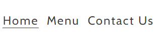

# [MILANS FOOD & SWEET CENTER](https://riiyu7.github.io/Milan-Food-CA)

We invite you to come and indulge in authentic Indian food with the 'Milans' family, where the taste of India is brought to you. The 'Milan’s family cater for everyone whether that will be for individuals, weddings or corporate events. Come and experience the taste of India with us.

This website displays the type of food we supply to our customers, as well as the services we offer. The information provided on the website provides an insight into our business and how we can help our customers.

## UX

### Colour Scheme

I primarily chose Maroon (#800000) to be used for my headings and logo as it represents a 'divine spark' in some indian culture as well as a connection to 'Mother Earth' and given that we use so many spices the colour seemed very fitting. To give the primary colour a good contrast I used White (#FFFFFF).

I used [coolors.co](https://coolors.co/800000-3a3a3a-ffd591-ffffff) to generate my colour palette.

### Typography

- [Cabin] (https://fonts.google.com/specimen/Cabin) was used throughout the website

- [sans-serif] was used as a secondary text if cabin failed.

- [Font Awesome](https://fontawesome.com) icons were used throughout the site, such as the social media icons in the footer.

## User Experience

## Goals

- Create a simple but visually appealing website.
- Quality and valuable content that is clear and straight to the point.
- Easy to use and navigate through website and Menu link.
- Responsive design on all devices.

### New Site Users

User 1 -  As a new site user, I would not want to see a webpage that is cluttered or hard to use, I would like to see something that provides me information quick and efficiently.

User 2 - When I look at a food website as a new user, my first go to link would be the Menu so I can get a little understanding of the type of food they will have. Im also not a fan of downloading PDF's onto my device so preferably id like to see the information on one page.

### Returning Site Users

User 1 - As returning user, I can see the webpage is easily viewable on my desktop and phone and it is not cluttered. The information displayed is clear and concise 

User 2- As returning user, I can see there is a menu link which displays all items on one page and is easy to use and navigate. Overall i like the design and the fact that social media links are provided below.

## Wireframes

### Mobile Wireframes

 Click here to see the Mobile Wireframes 

Home

  - 

Menu

  - 

### Tablet Wireframes

 Click here to see the Tablet Wireframes 

Home
  - 

Menu
  - 

### Desktop Wireframes

Click here to see the Desktop Wireframes 

Home

  - 

Menu

  - 

## Features

### Existing Features

#### Easy to use Nav Bar and social media icons

   - The navigation bar is simple and effective displaying the menu and home page only. The addition of the social media icons within the footer help the customers connect    
     with our social media accounts aswell giving them an insight into the work we do.

   - Screenshot of Nav Bar:

  

   - Screenshot of Social Media Icons:

   

#### Company Background

  - This section gives a brief background to who we are, what we can offer them and also why they can count on us to provide them the services they require.
  - Screenshot of Business Overview:

  

#### Services Overview

  - The services overview displays information about the type of catering we do which include weddings, events or corporate events. This section easily displays our services to 
    help clients understand what Milans can offer them.

  - Screenshot of Services Overview:

  

#### Simple Menu
  
  - The simple menu design provides information to the customer easily without the need of scorlling across to different sections with all the menu displayed together in a 
    organised manner.

  - Screenshot of Simple Menu:

  

### Future Features

- Gallery Page
    - Adding a Gallery page to display the food we provide on weddings and events
- Contact Form 
    - Add a contact form so customers can interact with our website with any questions they have
- Booking System
    - Add a simple booking system so customers who are looking to come in to test our food for events or weddings can easily find a time slot.
- Online Store
    - I would add an online store to the website so customers can buy and get orders shipped instead of using delivery partners.

## Tools & Technologies Used

- [HTML](https://en.wikipedia.org/wiki/HTML) used for the main site content.
- [CSS](https://en.wikipedia.org/wiki/CSS) used for the main site design and layout.
- [CSS :root variables](https://www.w3schools.com/css/css3_variables.asp) used for reusable styles throughout the site.
- [CSS Flexbox](https://www.w3schools.com/css/css3_flexbox.asp) used for an enhanced responsive layout.
- [CSS Grid](https://www.w3schools.com/css/css_grid.asp) used for an enhanced responsive layout.
- [JavaScript](https://www.javascript.com) used for user interaction on the site.
- [Python](https://www.python.org) used as the back-end programming language.
- [Git](https://git-scm.com) used for version control. (`git add`, `git commit`, `git push`)
- [GitHub](https://github.com) used for secure online code storage.
- [GitHub Pages](https://pages.github.com) used for hosting the deployed front-end site.
- [Gitpod](https://gitpod.io) used as a cloud-based IDE for development.
- [Bootstrap](https://getbootstrap.com) used as the front-end CSS framework for modern responsiveness and pre-built components.
- [Materialize](https://materializecss.com) used as the front-end CSS framework for modern responsiveness and pre-built components.
- [Am I Responsive](http://ami.responsivedesign.is/) - Used to verify responsiveness of website on different devices.

## Testing

For all testing, please refer to the [TESTING.md](TESTING.md) file.

## Deployment

The site was deployed to GitHub Pages. The steps to deploy are as follows:

- In the [GitHub repository](https://github.com/riiyu7/Milan-Food-CA), navigate to the Settings tab 
- From the source section drop-down menu, select the **Main** Branch, then click "Save".
- The page will be automatically refreshed with a detailed ribbon display to indicate the successful deployment.

The live link can be found [here](https://riiyu7.github.io/Milan-Food-CA)

### Local Deployment

This project can be cloned or forked in order to make a local copy on your own system.

#### Cloning

You can clone the repository by following these steps:

1. Go to the [GitHub repository](https://github.com/riiyu7/Milan-Food-CA) 
2. Locate the Code button above the list of files and click it 
3. Select if you prefer to clone using HTTPS, SSH, or GitHub CLI and click the copy button to copy the URL to your clipboard
4. Open Git Bash or Terminal
5. Change the current working directory to the one where you want the cloned directory
6. In your IDE Terminal, type the following command to clone my repository:
	- `git clone https://github.com/riiyu7/Milan-Food-CA.git`
7. Press Enter to create your local clone.

Alternatively, if using Gitpod, you can click below to create your own workspace using this repository.

Please note that in order to directly open the project in Gitpod, you need to have the browser extension installed.
A tutorial on how to do that can be found [here](https://www.gitpod.io/docs/configure/user-settings/browser-extension).

#### Forking

By forking the GitHub Repository, we make a copy of the original repository on our GitHub account to view and/or make changes without affecting the original owner's repository.
You can fork this repository by using the following steps:

1. Log in to GitHub and locate the [GitHub Repository](https://github.com/riiyu7/Milan-Food-CA)
2. At the top of the Repository (not top of page) just above the "Settings" Button on the menu, locate the "Fork" Button.
3. Once clicked, you should now have a copy of the original repository in your own GitHub account!

### Local VS Deployment

🛑🛑🛑🛑🛑 START OF NOTES (to be deleted) 🛑🛑🛑🛑🛑

Use this space to discuss any differences between the local version you've developed, and the live deployment site on GitHub Pages.

🛑🛑🛑🛑🛑 END OF NOTES (to be deleted) 🛑🛑🛑🛑🛑

## Credits

🛑🛑🛑🛑🛑 START OF NOTES (to be deleted) 🛑🛑🛑🛑🛑

In this section you need to reference where you got your content, media, and extra help from.
It is common practice to use code from other repositories and tutorials,
however, it is important to be very specific about these sources to avoid plagiarism.

🛑🛑🛑🛑🛑 END OF NOTES (to be deleted) 🛑🛑🛑🛑🛑

### Content

🛑🛑🛑🛑🛑 START OF NOTES (to be deleted) 🛑🛑🛑🛑🛑

Use this space to provide attribution links to any borrowed code snippets, elements, or resources.
A few examples have been provided below to give you some ideas.

Ideally, you should provide an actual link to every resource used, not just a generic link to the main site!

🛑🛑🛑🛑🛑 END OF NOTES (to be deleted) 🛑🛑🛑🛑🛑

| Source | Location | Notes |
| --- | --- | --- |
| [Markdown Builder](https://tim.2bn.dev/markdown-builder) | README and TESTING | tool to help generate the Markdown files |
| [Chris Beams](https://chris.beams.io/posts/git-commit) | version control | "How to Write a Git Commit Message" |
| [W3Schools](https://www.w3schools.com/howto/howto_js_topnav_responsive.asp) | entire site | responsive HTML/CSS/JS navbar |
| [W3Schools](https://www.w3schools.com/howto/howto_css_modals.asp) | contact page | interactive pop-up (modal) |
| [W3Schools](https://www.w3schools.com/css/css3_variables.asp) | entire site | how to use CSS :root variables |
| [Flexbox Froggy](https://flexboxfroggy.com/) | entire site | modern responsive layouts |
| [Grid Garden](https://cssgridgarden.com) | entire site | modern responsive layouts |
| [StackOverflow](https://stackoverflow.com/a/2450976) | quiz page | Fisher-Yates/Knuth shuffle in JS |
| [YouTube](https://www.youtube.com/watch?v=YL1F4dCUlLc) | leaderboard | using `localStorage()` in JS for high scores |
| [YouTube](https://www.youtube.com/watch?v=u51Zjlnui4Y) | PP3 terminal | tutorial for adding color to the Python terminal |
| [strftime](https://strftime.org) | CRUD functionality | helpful tool to format date/time from string |
| [WhiteNoise](http://whitenoise.evans.io) | entire site | hosting static files on Heroku temporarily |

### Media

🛑🛑🛑🛑🛑 START OF NOTES (to be deleted) 🛑🛑🛑🛑🛑

Use this space to provide attribution links to any images, videos, or audio files borrowed from online.
A few examples have been provided below to give you some ideas.

If you're the owner (or a close acquaintance) of all media files, then make sure to specify this.
Let the assessors know that you have explicit rights to use the media files within your project.

Ideally, you should provide an actual link to every media file used, not just a generic link to the main site!
The list below is by no means exhaustive. Within the Code Institute Slack community, you can find more "free media" links
by sending yourself the following command: `!freemedia`.

🛑🛑🛑🛑🛑 END OF NOTES (to be deleted) 🛑🛑🛑🛑🛑

| Source | Location | Type | Notes |
| --- | --- | --- | --- |
| [Pexels](https://www.pexels.com) | entire site | image | favicon on all pages |
| [Lorem Picsum](https://picsum.photos) | home page | image | hero image background |
| [Unsplash](https://unsplash.com) | product page | image | sample of fake products |
| [Pixabay](https://pixabay.com) | gallery page | image | group of photos for gallery |
| [Wallhere](https://wallhere.com) | footer | image | background wallpaper image in the footer |
| [This Person Does Not Exist](https://thispersondoesnotexist.com) | testimonials | image | headshots of fake testimonial images |
| [Audio Micro](https://www.audiomicro.com/free-sound-effects) | game page | audio | free audio files to generate the game sounds |
| [Videvo](https://www.videvo.net/) | home page | video | background video on the hero section |
| [TinyPNG](https://tinypng.com) | entire site | image | tool for image compression |

### Acknowledgements

🛑🛑🛑🛑🛑 START OF NOTES (to be deleted) 🛑🛑🛑🛑🛑

Use this space to provide attribution to any supports that helped, encouraged, or supported you throughout the development stages of this project.
A few examples have been provided below to give you some ideas.

🛑🛑🛑🛑🛑 END OF NOTES (to be deleted) 🛑🛑🛑🛑🛑

- I would like to thank my Code Institute mentor, [Tim Nelson](https://github.com/TravelTimN) for their support throughout the development of this project.
- I would like to thank the [Code Institute](https://codeinstitute.net) tutor team for their assistance with troubleshooting and debugging some project issues.
- I would like to thank the [Code Institute Slack community](https://code-institute-room.slack.com) for the moral support; it kept me going during periods of self doubt and imposter syndrome.
- I would like to thank my partner (John/Jane), for believing in me, and allowing me to make this transition into software development.
- I would like to thank my employer, for supporting me in my career development change towards becoming a software developer.
