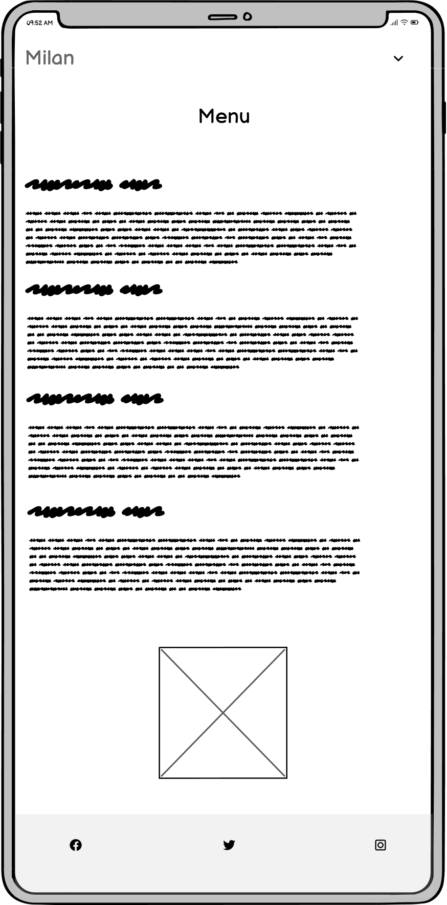

# [MILANS FOOD & SWEET CENTER](https://riiyu7.github.io/Milan-Food-CA)

We invite you to come and indulge in authentic Indian food with the 'Milans' family, where the taste of India is brought to you. The 'Milan’s family cater for everyone whether that will be for individuals, weddings or corporate events. Come and experience the taste of India with us.

This website displays the type of food we supply to our customers, as well as the services we offer. The information provided on the website provides an insight into our business and how we can help our customers.

## UX

### Colour Scheme

I primarily chose Maroon (#800000) to be used for my headings and logo as it represents a 'divine spark' in some indian culture as well as a connection to 'Mother Earth' and given that we use so many spices the colour seemed very fitting. To give the primary colour a good contrast I used White (#FFFFFF).

I used [coolors.co](https://coolors.co/800000-3a3a3a-ffd591-ffffff) to generate my colour palette.

### Typography

- [Cabin] (https://fonts.google.com/specimen/Cabin) was used throughout the website

- [sans-serif] was used as a secondary text if cabin failed.

- [Font Awesome](https://fontawesome.com) icons were used throughout the site, such as the social media icons in the footer.

## User Experience

## Goals

- Create a simple but visually appealing website.
- Quality and valuable content that is clear and straight to the point.
- Easy to use and navigate through website and Menu link.
- Responsive design on all devices.

### New Site Users

As a new site user, I would not want to see a webpage that is cluttered or hard to use, I would like to see something that provides me information quick and efficiently.

When I look at a food website as a new user, my first go to link would be the Menu so I can get a little understanding of the type of food they will have. Im also not a fan of downloading PDF's onto my device so preferably id like to see the information on one page.

As I site user and potential client, I want to easily find out opening times and contact information so i know what days the business is closed.

### Returning Site Users

As returning user, I want to be able to access the website through my phone at times I might be on the go, I would want to see similarities in the page from desktop and mobile so its easy to navigate.

## Wireframes

### Mobile Wireframes

 Click here to see the Mobile Wireframes 

Home

  - 

Menu

  - 

### Tablet Wireframes

 Click here to see the Tablet Wireframes 

Home
  - 

Menu
  - 

### Desktop Wireframes

Click here to see the Desktop Wireframes 

Home

  - 

Menu

  - 

## Features

### Existing Features

#### Easy to use Nav Bar and social media icons

   - The navigation bar is simple and effective displaying the menu and home page only. The addition of the social media icons within the footer help the customers connect    
     with our social media accounts aswell giving them an insight into the work we do.

   - Screenshot of Nav Bar:

  

   - Screenshot of Social Media Icons:

   

#### Company Background

  - This section gives a brief background to who we are, what we can offer them and also why they can count on us to provide them the services they require.
  - Screenshot of Business Overview:

  

#### Services Overview

  - The services overview displays information about the type of catering we do which include weddings, events or corporate events. This section easily displays our services to 
    help clients understand what Milans can offer them.

  - Screenshot of Services Overview:

  

#### Simple Menu
  
  - The simple menu design provides information to the customer easily without the need of scorlling across to different sections with all the menu displayed together in a 
    organised manner.

  - Screenshot of Simple Menu:

  

### Future Features

- Gallery Page
    - Adding a Gallery page to display the food we provide on weddings and events
- Contact Form 
    - Add a contact form so customers can interact with our website with any questions they have
- Booking System
    - Add a simple booking system so customers who are looking to come in to test our food for events or weddings can easily find a time slot.
- Online Store
    - I would add an online store to the website so customers can buy and get orders shipped instead of using delivery partners.

## Tools & Technologies Used

- [HTML](https://en.wikipedia.org/wiki/HTML) used for the main site content.
- [CSS](https://en.wikipedia.org/wiki/CSS) used for the main site design and layout.
- [CSS :root variables](https://www.w3schools.com/css/css3_variables.asp) used for reusable styles throughout the site.
- [CSS Flexbox](https://www.w3schools.com/css/css3_flexbox.asp) used for an enhanced responsive layout.
- [CSS Grid](https://www.w3schools.com/css/css_grid.asp) used for an enhanced responsive layout.
- [JavaScript](https://www.javascript.com) used for user interaction on the site.
- [Python](https://www.python.org) used as the back-end programming language.
- [Git](https://git-scm.com) used for version control. (`git add`, `git commit`, `git push`)
- [GitHub](https://github.com) used for secure online code storage.
- [GitHub Pages](https://pages.github.com) used for hosting the deployed front-end site.
- [Gitpod](https://gitpod.io) used as a cloud-based IDE for development.
- [Bootstrap](https://getbootstrap.com) used as the front-end CSS framework for modern responsiveness and pre-built components.
- [Materialize](https://materializecss.com) used as the front-end CSS framework for modern responsiveness and pre-built components.
- [Am I Responsive](http://ami.responsivedesign.is/) - Used to verify responsiveness of website on different devices.

## Testing

For all testing, please refer to the [TESTING.md](TESTING.md) file.

## Deployment

The site was deployed to GitHub Pages. The steps to deploy are as follows:

- In the [GitHub repository](https://github.com/riiyu7/Milan-Food-CA), navigate to the Settings tab 
- From the source section drop-down menu, select the **Main** Branch, then click "Save".
- The page will be automatically refreshed with a detailed ribbon display to indicate the successful deployment.

The live link can be found [here](https://riiyu7.github.io/Milan-Food-CA)

### Local Deployment

This project can be cloned or forked in order to make a local copy on your own system.

#### Cloning

You can clone the repository by following these steps:

1. Go to the [GitHub repository](https://github.com/riiyu7/Milan-Food-CA) 
2. Locate the Code button above the list of files and click it 
3. Select if you prefer to clone using HTTPS, SSH, or GitHub CLI and click the copy button to copy the URL to your clipboard
4. Open Git Bash or Terminal
5. Change the current working directory to the one where you want the cloned directory
6. In your IDE Terminal, type the following command to clone my repository:
	- `git clone https://github.com/riiyu7/Milan-Food-CA.git`
7. Press Enter to create your local clone.

Alternatively, if using Gitpod, you can click below to create your own workspace using this repository.

Please note that in order to directly open the project in Gitpod, you need to have the browser extension installed.
A tutorial on how to do that can be found [here](https://www.gitpod.io/docs/configure/user-settings/browser-extension).

#### Forking

By forking the GitHub Repository, we make a copy of the original repository on our GitHub account to view and/or make changes without affecting the original owner's repository.
You can fork this repository by using the following steps:

1. Log in to GitHub and locate the [GitHub Repository](https://github.com/riiyu7/Milan-Food-CA)
2. At the top of the Repository (not top of page) just above the "Settings" Button on the menu, locate the "Fork" Button.
3. Once clicked, you should now have a copy of the original repository in your own GitHub account!

### Local VS Deployment

While testing my local site vs deployment I didnt notice anything different and the website adapted across all media screens without any design issues.

## Credits

I wouldd like to thank everyone who helped with the website, I was inspired with some of the ideas seen on other Indian resturant pages such as Jolly Catering.

### Content

- [Markdown Builder](https://tim.2bn.dev/markdown-builder) | README and TESTING | tool to help generate the Markdown files |
- [Jolly Catering](https://jollycatering.co.uk/) | content and Ideas | I got inspiration for my content and ideas from this website. |
- [Majestic Form](https://www.majesticform.com/form-guides/html-email-form) | Form code | code for form which wasnt used in the end. |
- [Love Running](https://learn.codeinstitute.net/) | Code | used code from Love Running project to assit with the fundamentals of my project|

  

### Media

- [Hero image](https://cdn11.bigcommerce.com/s-q1r8ac87/product_images/uploaded_images/spices.jpg)| Image | Image was used for my hero section | 
- [bg-pattern image](https://kajabi-storefronts-production.kajabi-cdn.com/kajabi-storefronts-production/file-uploads/blogs/2147509972/images/3acd38b-d081-2f5d-f785-a173c6bdab21_Indian-Floral.jpg) | Image | Image was used for my sections near the footer | 
- [indian-food](https://www.getintonewcastle.co.uk/images/uploads/pexels-anil-sharma-10580198.jpg?w=1200&h=630&fit=crop&fm=pjpg&q=90) | Image | Image was used in the why us section|
- [indian-food-banner](https://www.matchingfoodandwine.com/files/blogattachments/top/indian-food@2x.jpg)| Image | Image was used for my sections near the footer | 
- [Font Awesome Favicon](https://fontawesome.com/) | Favicon |

### Acknowledgements

- I would like to thank my Code Institute mentor, [Tim Nelson](https://github.com/TravelTimN) for their support throughout the development of this project.
- I would like to thank the [Code Institute](https://codeinstitute.net) tutor team for their assistance with troubleshooting and debugging some project issues.
- I would like to thank the [Code Institute Slack community](https://code-institute-room.slack.com) for the moral support; it kept me going during periods of self doubt and imposter syndrome.
- I would like to thank my employer, for supporting me in my career development change towards becoming a software developer.
