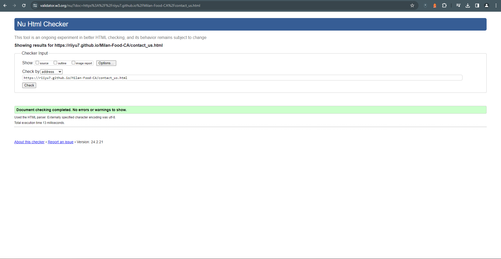
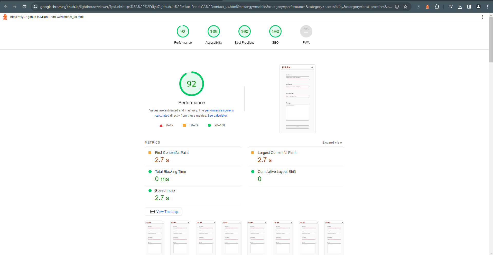
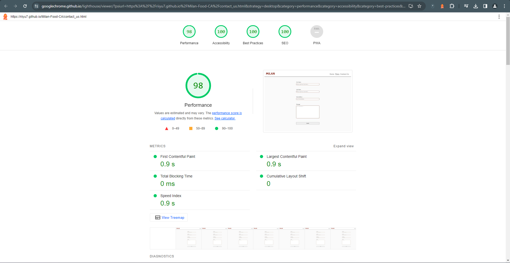

# Testing

Return back to the [README.md](README.md) file.

## Code Validation

### HTML

I have used the recommended [HTML W3C Validator](https://validator.w3.org) to validate all of my HTML files.

| Page       | W3C URL                                                                                                         | Screenshot                                                            | Notes           |
| ---------  | ----------------------------------------------------------------------------------------------------------------| --------------------------------------------------------------------- | --------------- |
| Home       | [W3C](https://validator.w3.org/nu/?doc=https%3A%2F%2Friiyu7.github.io%2FMilan-Food-CA%2Findex.html)             |          | pass: No errors |
| Menu       | [W3C](https://validator.w3.org/nu/?doc=https%3A%2F%2Friiyu7.github.io%2FMilan-Food-CA%2Fmenu.html)              |          | pass: No errors |
| Contact Us | [W3C](https://validator.w3.org/nu/?doc=https%3A%2F%2Friiyu7.github.io%2FMilan-Food-CA%2Fcontact_us.html)        |            | pass: No errors |
| Thank You  | [W3C](https://validator.w3.org/nu/?doc=https%3A%2F%2Friiyu7.github.io%2FMilan-Food-CA%2Fthank_you.html)         |     | pass: No errors |

### CSS

I have used the recommended [CSS Jigsaw Validator](https://jigsaw.w3.org/css-validator) to validate all of my CSS files.

| File      | Jigsaw URL                                                                                                  | Screenshot                                                   | Notes           |
| --------- | ----------------------------------------------------------------------------------------------------------- |------------------------------------------------------------- | --------------- |
| style.css | [Jigsaw](https://jigsaw.w3.org/css-validator/validator?uri=https%3A%2F%2Friiyu7.github.io%2FMilan-Food-CA%2F&profile=css3svg&usermedium=all&warning=1&vextwarning=&lang=en)  |       | Pass: No Errors |

## Browser Compatibility

I've tested my deployed project on multiple browsers to check for compatibility issues.

| Browser | Home                                                         | Menu                                                         | Contact Us                                                 | Thank You | Notes              |
| ------- | ------------------------------------------------------------ | ------------------------------------------------------------ | ---------------------------------------------------------  | --------- | ------------------ |
| Chrome  |  |  |  |       | Works as expected  |
| Edge    |    |    |    |      | Works as expected  |
| Brave   |   |   |   |       | Works as expected  |

## Responsiveness

I've tested my deployed project on multiple devices to check for responsiveness issues.

| Device                | Home                                                              | Menu                                                             | Contact Us    | Thank You                                                | 
| --------------------- | ----------------------------------------------------------------- | ---------------------------------------------------------------- | ------------- | --------------------------------------------------------- |
| Galaxy S23 Ultra      |        |       |  |          |
| Tablet (DevTools)     |    |   |  |       |
| Desktop (DevTools)    |   |  |  |         |

There are slight noticeable scaling issues on the contact_us.html page.

## Lighthouse Audit

I've tested my deployed project using the Lighthouse Audit tool to check for any major issues.

| Page       | Mobile                                                          | Desktop                                                        | Notes               |
| ----       | --------------------------------------------------------------- | -------------------------------------------------------------  | ------------------- |
| Home       |          |        | Some minor warnings |
| Menu       |          |        | Some minor warnings |
| Contact Us |    |  | Some minor warnings |
| Thank You  |     |   | Some minor warnings |

The main issues I faced with the home screen for both desktop and mobile are the following: 

Serve static assets with an efficient cache policy & Serve images in next-gen formats

## User Story Testing

| User Story                                                                    | Screenshot | Outcome |
| ----------------------------------------------------------------------------- | ---------- | ------- |
| As a new site user, I would not want to see a webpage that is cluttered or hard to use, I would like to see something that provides me information quick and efficiently.|  | Passed: The site features a simple and easily readable design which doesnt feel overwhelming |
| When I look at a food website as a new user, my first go to link would be the Menu so I can get a little understanding of the type of food they will have. Im also not a fan of downloading PDF's onto my device so preferably id like to see the information on one page. |  | Passed: A seperate page displays the menu with an easy to read layout. 
|As a site user and potential client, I want to easily find out opening times and contact information so i know what days the business is closed. |  | Passed: Easy to read contact information with opening times at the bottom of the screen.|
|As returning user, I want to be able to access the website through my phone at times I might be on the go, I would want to see similarities in the page from desktop and mobile so its easy to navigate. |  |Passed: Website is responsive on mobile devices aswell as desktop.|

## Bugs

There are no remaining bugs that I am aware of.
