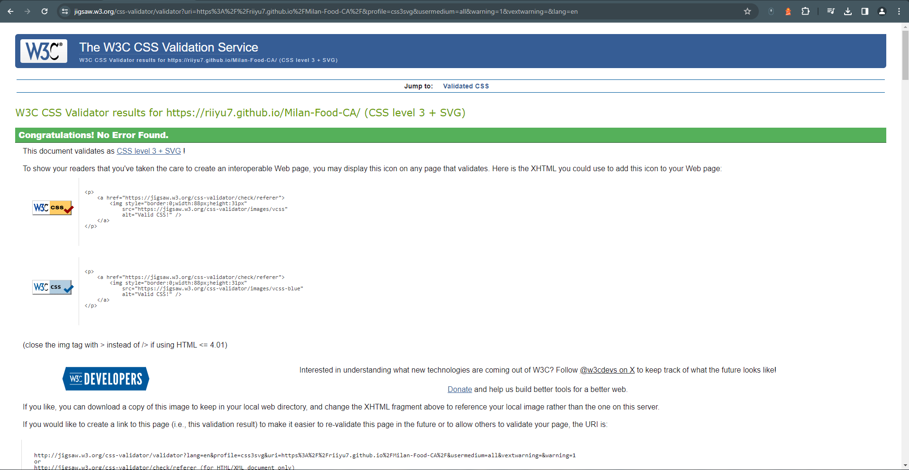

# Testing

Return back to the [README.md](README.md) file.

## Code Validation

### HTML

I have used the recommended [HTML W3C Validator](https://validator.w3.org) to validate all of my HTML files.

| Page | W3C URL                                                                                             | Screenshot |                                          |Notes            |
| ---  | -------------------------------------------------------------------------------------------------   | ---------- | ---------------------------------------- | --------------- |
| Home | [W3C](https://validator.w3.org/nu/?doc=https%3A%2F%2Friiyu7.github.io%2FMilan-Food-CA%2Findex.html) |  | pass: No errors |
| Menu | [W3C](https://validator.w3.org/nu/?doc=https%3A%2F%2Friiyu7.github.io%2FMilan-Food-CA%2Fmenu.html) |  | pass: No errors |

### CSS

I have used the recommended [CSS Jigsaw Validator](https://jigsaw.w3.org/css-validator) to validate all of my CSS files.

| File      | Jigsaw URL                                                                                                 | Screenshot                                                    | Notes           |
| --------- | ---------- ------------------------------------------------------------------------------------------------| ------------------------------------------------------------- | --------------- |
| style.css | [Jigsaw](https://jigsaw.w3.org/css-validator/validator?uri=https%3A%2F%2Friiyu7.github.io%2FMilan-Food-CA) |        | Pass: No Errors |

## Browser Compatibility

🛑🛑🛑🛑🛑 START OF NOTES (to be deleted) 🛑🛑🛑🛑🛑

Use this space to discuss testing the live/deployed site on various browsers.

Consider testing at least 3 different browsers, if available on your system.

Recommended browsers to consider:
- [Chrome](https://www.google.com/chrome)
- [Firefox (Developer Edition)](https://www.mozilla.org/firefox/developer)
- [Edge](https://www.microsoft.com/edge)
- [Safari](https://support.apple.com/downloads/safari)
- [Brave](https://brave.com/download)
- [Opera](https://www.opera.com/download)

**IMPORTANT**: You must provide screenshots of the tested browsers, to "prove" that you've actually tested them.

Please note, there are services out there that can test multiple browser compatibilities at the same time.
Some of these are paid services, but some are free.
If you use these, you must provide a link to the source used for attribution, and multiple screenshots of the results.

Sample browser testing documentation:

🛑🛑🛑🛑🛑 END OF NOTES (to be deleted) 🛑🛑🛑🛑🛑

I've tested my deployed project on multiple browsers to check for compatibility issues.

| Browser | Home                                                         | Menu                                                         | Notes              |
| ------- | ------------------------------------------------------------ | ------------------------------------------------------------ | ------------------ |
| Chrome  |  |  | Works as expected  |
| Edge    |    |    | Works as expected  |
| Brave   |   |   | Works as expected   |

## Responsiveness

I've tested my deployed project on multiple devices to check for responsiveness issues.

| Device                | Home                                                           | Menu                                                             |   Notes            |
| -------------------| ----------------------------------------------------------------- | ---------------------------------------------------------------- | ------------------ |
| Galaxy S23 Ultra   |        |       | Works as expected  |
| Tablet (DevTools)  |    |   | Works as expected  |
| Desktop (DevTools) |   |  | Works as expected  |

## Lighthouse Audit

I've tested my deployed project using the Lighthouse Audit tool to check for any major issues.

| Page | Mobile                                                    | Desktop                                                   | Notes               |
| ---- | --------------------------------------------------------  | --------------------------------------------------------- | ------------------- |
| Home |    |   | Some minor warnings |
| Menu |    |   | Some minor warnings |

The main issues I faced with the home screen for both desktop and mobile are the following: 

Serve static assets with an efficient cache policy & Serve images in next-gen formats

## User Story Testing

| User Story | Screenshot | Test Result | 

| ---------- | ---------- | ----------- | 
| As a new site user, I would not want to see a webpage that is cluttered or hard to use, I would like to see something that provides me information quick and efficiently.|  | Passed: The site features a simple and easily readable design which doesnt feel overwhelming |

|When I look at a food website as a new user, my first go to link would be the Menu so I can get a little understanding of the type of food they will have. Im also not a fan of downloading PDF's onto my device so preferably id like to see the information on one page. |  | Passed: A seperate page displays the menu with an easy to read layout. 

|As a site user and potential client, I want to easily find out opening times and contact information so i know what days the business is closed.
|  | Passed: Easy to read contact information with opening times at the bottom of the screen.|

|As returning user, I want to be able to access the website through my phone at times I might be on the go, I would want to see similarities in the page from desktop and mobile so its easy to navigate. |  |Passed: Website is responsive on mobile devices aswell as desktop.|

| As a site administrator, I should be able to ____________, so that I can ____________. |  |
| As a site administrator, I should be able to ____________, so that I can ____________. |  |
| As a site administrator, I should be able to ____________, so that I can ____________. |  |
|

## Bugs

There are no remaining bugs that I am aware of.
